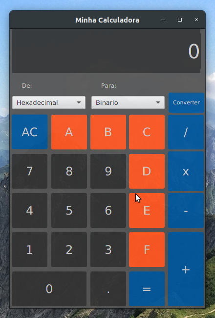
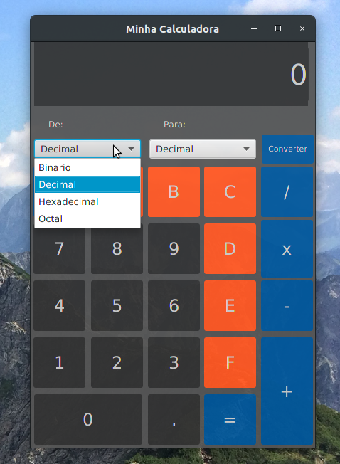
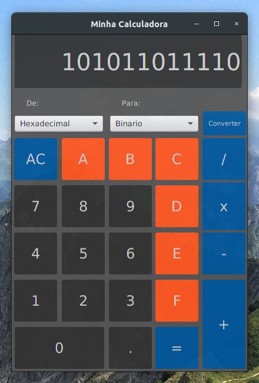

# Calculator with converter
A calculator with a numeric base converter (decimal, binary, octal and hexadecimal).  This project was created for a college work about Introduction to Logic Programming applying knowledge of introduction to computing.

## Technologies used
- Java version : openjdk 11.0.8
- Java FX version: 11.0.2

## screenshots of calculator

